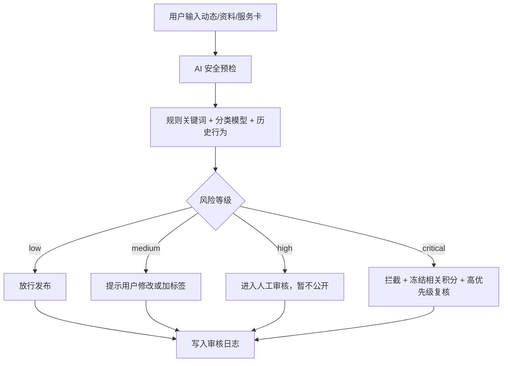

# 华伴自动内容审核处理机制

更新日期：2026-07-28

本文件定义华伴 V1.1 的内容安全自动审核能力。参考 X 的公开做法，但不照搬：华伴采用“自动检测 + 用户举报 + 人工复核 + 申诉纠错 + 透明记录”的平台治理结构。

## 1. 设计目标

华伴必须具备自动审核处理能力，而不是只靠人工。

目标：

- 保护用户安全，降低诈骗、骚扰、侵权、未成年人风险和违法内容传播。
- 让 AI 参与审核，但不让 AI 成为最终裁判。
- 对不同风险采取不同强度处置，不把所有问题都简单删除。
- 所有处置要可追踪、可复核、可申诉、可回滚。

## 2. 可借鉴的 X 式做法

X 公开说明中值得借鉴的机制：

- 机器学习和人工审核结合。
- 既有主动检测，也接受用户举报。
- 处置分内容级和账号级。
- 处置方式不止删除，还包括敏感标签、降低可见性、从搜索/推荐中移除、账号只读、验证身份、暂停账号。
- 敏感媒体可由用户自行标记，也可由平台自动标记。
- 用户可以申诉。
- 平台需要透明报告和执行数据。

华伴对应实现：

```text
自动检测 → 风险分级 → 处置建议 → 用户提示/后台审核 → 发布或限制 → 举报/申诉 → 复核和回滚
```

## 3. 审核对象

第一阶段必须纳入审核：

- 动态：文字、图片、视频、评论、转发语。
- 个人资料：昵称、头像、简介、二维码名片、AI 伙伴形象。
- 聊天与群聊：只在用户举报、明显风险或安全模型触发时进入审核，不做无差别公开审查。
- 市集/小店：服务卡、价格、库存、联系方式、优惠券、API 授权说明。
- 自动化输出：n8n 生成或同步的服务卡、FAQ、客服回复、公告。
- 积分事件：疑似刷分、诱导邀请、批量注册、异常推荐链。

## 4. 风险分类

使用统一 `risk_category`：

| 类别 | 说明 | 默认处理 |
| --- | --- | --- |
| `illegal` | 违法交易、诈骗、洗钱、伪造证件、毒品、武器等 | 拦截 + 人工复核 |
| `child_safety` | 未成年人风险、诱导私聊、性剥削或疑似剥削 | 拦截 + 高优先级复核 |
| `harassment` | 骚扰、威胁、羞辱、跟踪、人肉搜索 | 限制展示或复核 |
| `hate` | 基于身份的攻击、仇恨或煽动 | 限制展示或移除 |
| `privacy` | 泄露电话、地址、证件、聊天截图等私人信息 | 提醒修改或拦截 |
| `sexual` | 成人内容、色情招揽、不适合公开内容 | 敏感标签/年龄限制/复核 |
| `violence` | 暴力威胁、血腥、鼓励伤害 | 标签、移除或复核 |
| `self_harm` | 自伤自杀鼓励、方法指导 | 拦截有害内容，给支持提示 |
| `regulated` | 移民、法律、医疗、金融、借贷、工作、租房等高风险服务 | 加提示 + 复核 |
| `misleading` | 虚假身份、虚假服务、夸大收益、假评价 | 限制推荐 + 复核 |
| `ip_rights` | 版权、商标、肖像、盗图、冒用头像 | 提醒授权或复核 |
| `spam_abuse` | 刷积分、批量加好友、群发、自动化骚扰 | 降权/限制账号 |

## 5. 风险分级

统一 `risk_level`：

- `low`：可发布，但记录审核结果。
- `medium`：发布前提示用户修改，或发布后降推荐。
- `high`：进入人工审核，审核前不公开展示。
- `critical`：直接拦截，必要时限制账号、冻结积分事件、进入人工高优先级队列。

## 6. 处置动作

统一 `enforcement_action`：

| 动作 | 含义 |
| --- | --- |
| `allow` | 放行 |
| `user_warning` | 给用户轻提示，允许修改后继续 |
| `sensitive_label` | 加敏感提示标签 |
| `age_gate` | 遮挡内容，要求成年证明或年龄确认后查看 |
| `limit_visibility` | 降低可见性，不进推荐/搜索 |
| `hold_for_review` | 暂不公开，进入人工审核 |
| `remove_content` | 移除内容 |
| `lock_feature` | 暂停发布、评论、私信、自动化等部分能力 |
| `verify_identity` | 要求手机号/邮箱/身份码再确认 |
| `freeze_points` | 相关积分事件暂不入账 |
| `escalate_human` | 升级人工复核 |
| `appeal_open` | 允许用户申诉 |

## 6.1 成人与儿童内容展示规则

华伴必须把“成人合法敏感内容”和“儿童/未成年人安全风险内容”分开处理。

### 成人合法敏感内容

适用范围：

- 成人话题、成人活动、成人向图片或文字，但不涉及违法、剥削、胁迫、未成年人、骚扰或隐私泄露。
- 血腥、暴力、医疗创伤、事故现场等可能引起不适但具有合理表达场景的内容。

展示流程：

```text
内容遮挡 → 显示敏感提示 → 要求成年证明/年龄确认 → 用户主动打开 → 记录查看确认
```

默认处理：

- 不进入未成年用户的信息流。
- 不进入游客、未登录或年龄未知用户的信息流。
- 不进入强推荐、附近默认推荐和高曝光位置。
- 图片/视频默认模糊或封面遮挡。
- 文字只显示标题和风险提示，不直接展开正文。

### 儿童/未成年人风险内容

以下内容不能通过“成年证明”打开：

- 未成年人性化内容、诱导私聊、性暗示、性剥削或疑似剥削。
- 暴露未成年人隐私：学校、住址、联系方式、行踪、证件、聊天截图。
- 针对未成年人的欺诈、招揽、危险挑战、胁迫、诱导离家或线下见面。
- 明显损害儿童安全和尊严的图片、视频、文字或 AI 生成内容。

默认处理：

```text
直接拦截 → 高优先级人工审核 → 必要时限制账号/功能 → 保留证据和处置日志
```

### 年龄未知用户

年龄未知时按更保守规则处理：

- 不展示成人敏感内容。
- 允许用户进入年龄确认或成年证明流程。
- 完成确认前，只显示遮挡卡片和简短说明。

### 前端展示口径

遮挡卡片文案：

```text
此内容可能不适合所有人
确认已成年后可查看
```

涉及未成年人风险的拦截文案：

```text
此内容涉及未成年人安全风险，不能展示。我们会交给人工复核。
```

## 7. 发布前流程



## 8. 发布后流程

发布后仍需持续巡检：

- 用户举报触发复核。
- AI 定时抽检城市内容流。
- 内容突然传播、被大量收藏/转发、被多次举报时提高风险分。
- 服务卡/API 自动化输出每次变更后重新审核。
- 账号重复违规时从内容级处置升级为账号级处置。

## 9. 用户举报与申诉

每条动态、资料、小店服务卡和聊天举报入口都应包含：

- 诈骗或虚假服务。
- 骚扰或威胁。
- 泄露隐私。
- 侵权或冒用。
- 成人或未成年人风险。
- 违法或危险交易。
- 其他。

申诉机制：

- 用户可查看被限制的大致原因。
- 用户可修改内容后重新提交。
- 用户可提交申诉说明。
- 人工复核后保留原结论、复核人、复核时间和变更记录。

## 10. 后台必须看到的字段

审核队列每条记录至少包括：

- 内容对象：`ref_type`、`ref_id`。
- 作者：`actor_user_id`、`identity_code`、`city`。
- 风险：`risk_category`、`risk_level`、`risk_score`、`matched_rules`。
- 处置：`suggested_action`、`final_action`、`status`。
- AI 摘要：`ai_reason`、`input_summary`、`output_summary`。
- 人工：`reviewer_id`、`review_note`、`reviewed_at`。
- 申诉：`appeal_status`、`appeal_note`、`appeal_result`。
- 时间：`created_at`、`updated_at`。

## 11. 与积分系统的关系

内容未通过审核前，不能确认积分入账。

规则：

- 动态发布积分先写 `pending_review`。
- 审核通过后改为 `confirmed`。
- 内容被移除后，相关积分改为 `reversed` 或冻结。
- 刷分、批量邀请、异常推荐链进入 `spam_abuse` 风险队列。

## 12. 与 n8n 的关系

n8n 不能绕过审核。

自动化只执行：

- 用户已授权。
- 后台审核通过。
- 风险状态不是 `high` 或 `critical`。
- 有可回滚记录。

内容审核相关工作流：

- `HB11_Content_Precheck`：发布前检测。
- `HB11_Content_Report_Triage`：举报分流。
- `HB11_City_Content_Review_Assist`：城市内容审核助手。
- `HB11_Account_Risk_Update`：账号风险分更新。
- `HB11_Moderation_Transparency_Snapshot`：审核数据日报。

## 13. 前端提示口径

轻提示：

```text
发布前请确认内容真实、可公开；违法、诈骗、骚扰、侵权和高风险内容会进入审核或被拦截。
```

AI 口语解释：

```text
华伴会先用 AI 和规则做一次安全预检。普通内容直接发，高风险内容会提醒你改，严重问题会先不公开，交给人工复核。这样做不是为了打扰你，而是为了避免诈骗、骚扰、隐私泄露和违法内容影响别人。
```

## 14. 后续上线前检查

- 是否有内容审核表。
- 是否有举报表。
- 是否有申诉表。
- 是否有账号风险状态。
- 是否有积分冻结/冲正联动。
- 是否有 n8n 审核前置条件。
- 是否有后台人工复核页面。
- 是否能输出审核日报和透明度统计。
