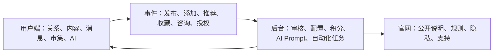

# 华伴 V1.1 产品内在关联逻辑

本文件用于把用户端、官网、后台三块设计固定在同一套产品骨架上。它是内部设计依据，不作为对外宣传文案。

## 1. 核心对象

华伴 V1.1 先围绕七类对象设计页面与数据：

| 对象 | 用户端出现位置 | 后台管理位置 | 官网表达方式 |
| --- | --- | --- | --- |
| 用户身份 | 我的名片、二维码、华伴号、个人主页 | 用户管理、身份码审计 | 可信本地身份与名片 |
| 好友关系 | 通讯录、聊天、备注、标签、推荐给朋友 | 名片关系、来源、地域分组 | 关系沉淀与本地连接 |
| 内容动态 | 动态、附近、个人主页笔记 | 动态管理、城市内容审核 | 本地生活内容流 |
| 消息协作 | 首页、聊天、群聊、AI 对话 | 消息摘要、AI Prompt | AI 陪伴每个沟通环节 |
| 小店/API | 市集、小店与卡包、服务卡、优惠券 | 供给侧、API 授权、自动化任务 | 低代码/无代码经营入口 |
| 积分等级 | 我的积分、任务、等级权益 | 积分等级、流水、风控 | 参与权益机制 |
| 共创贡献 | 反馈、邀请、内容共建、冷启动任务 | 共创权重、审核、分配口径 | 早期共建者计划 |

## 2. 三端关系

用户端负责体验，官网负责说明，后台负责控制。三者不能各说各话。



## 3. 用户端功能链

用户端不是单个聊天页，而是一个本地生活操作台：

1. 首页：对话中心，用户与用户、用户与 AI 的会话都在这里切换；AI 输入框常驻。
2. 通讯录/名片：用户沉淀好友、备注、标签、来源、地域分组。
3. 动态/附近：用户看到本地动态、问题、服务、活动和人。
4. 发布：用户可从相册、拍摄、文字生图、文件进入，AI 帮生成图片、整理配文、标签、城市、可见范围。
5. 市集/小店：用户看服务、商品、优惠券、个人卡包；商家未来可授权 API。
6. 我的：身份码、积分、等级、店铺、群组、浏览记录和设置集中管理。

每个用户动作都应该产生可追踪事件：`actor_user_id`、`target_id`、`action_type`、`source_page`、`city`、`ai_assisted`、`points_delta`、`review_status`。

## 4. AI 参与边界

AI 是协助者，不替用户越权操作。

每个用户都可以拥有自己的 AI 伙伴：

- 可给 AI 起名。
- 可选择或设计 AI 形象。
- 可调活泼程度，适配年轻用户喜欢的表达风格。
- 可在重大节假日启用帽子、围巾、花环、星星等轻量皮肤。
- 用户自己的头像也可编辑，但需要保留身份码和审核追踪。

AI 伙伴个性化不改变华伴主 CI：Logo 主轮廓、华伴绿、连接蓝、暖黄星标仍是品牌锚点。

AI 可以做：

- 搜索动态、名片、市集、服务。
- 整理发布内容、生成标题、打标签、建议可见范围。
- 总结聊天、提炼备注、识别联系方式和需求线索。
- 帮商家配置小店、服务卡、常见问答、API 字段映射。
- 生成后台待审核建议和运营风险提醒。
- 通过语音/文字操控华伴内部功能：简单提示词打开单一功能，多提示词执行多步骤任务，语义理解后生成图文视频、制作表单和配置自动化草稿。

AI 不直接做：

- 未授权添加好友、群发、支付、下单、读取外部 API。
- 把积分/等级描述成投资收益。
- 绕过后台审核发布敏感服务或承诺交易结果。

当前 AI 模型按 6 个能力位管理：

| 模型位 | 主要职责 |
| --- | --- |
| 对话助手模型 | 用户日常聊天、页面控制、功能解释 |
| 发布整理模型 | 动态配文、标题、标签、可见范围建议 |
| 本地搜索模型 | 附近动态、名片、市集和服务线索搜索 |
| 关系推荐模型 | 好友推荐、共同兴趣、地域分组、推荐理由 |
| 审核风控模型 | 内容审核建议、积分异常、服务卡风险提示 |
| 自动化配置模型 | 小店 API 字段映射、n8n 工作流草稿、运行摘要 |

这 6 个模型位可以先由同一个底层模型承载，但产品和后台要按职责拆开记录 Prompt、日志、权限和结果。

## 4.1 当前外部接口边界

V1.1 当前只确认 2 个外部接口：

| 外部接口 | 用途 | 后台要求 |
| --- | --- | --- |
| Google Map | 地图、地址、距离、附近范围、城市定位 | API Key 独立配置；调用日志记录城市、坐标和来源页面 |
| 手机号验证 | 注册、登录、身份码绑定、账号找回 | 验证供应商独立配置；记录发送、验证、失败、冷却和风控状态 |

除这两个接口外，其他 API 都先按“预留/待授权/待审核”处理，不默认进入第一阶段生产接入。

## 5. 积分、等级、共创

推广驱动力的内部公式：

`推广驱动力 = 积分 × 等级权益权重 × 共创特别权重`

解释口径：

- 积分奖励参与：发布、反馈、完善名片、邀请、推荐、共建内容。
- 等级奖励参与时间：越早参与、持续参与，等级权益权重越高。
- 共创奖励冷启动：早期帮助产品从 0 到 1 的贡献需要额外被记录。
- 华伴负责打磨优化产品：后台必须能审核、修正、回滚和解释每笔积分。

## 6. 小店/API 与自动化

小店不是第一阶段重交易平台，而是低代码/无代码 + AI 的经营连接点。

第一阶段：

- 服务资料展示、卡券展示、联系方式、AI 咨询、收藏、转发。
- 商家可用表单或对话配置服务卡。
- 后台审核资料完整度、来源、风险和联系方式。

第二阶段：

- 用户授权外部 API：库存、菜单、预约、报价、课程表、车辆排班、订单状态。
- AI 帮用户配置字段映射和自动化流程。
- n8n 或后端任务执行同步、提醒、摘要、回滚记录。

## 6.1 n8n 工作流定位

n8n 是华伴 V1.1 的自动化执行引擎，必须从设计阶段就进入后台信息架构。

它负责：

- 接收后台审核通过的自动化任务。
- 执行 API 同步、消息提醒、服务卡更新、线索整理、表格写入、Webhook 回调。
- 保存每次运行日志、输入、输出、错误、重试次数和人工接管状态。
- 让 AI 生成或解释流程配置，但最终由用户授权和后台审核决定是否启用。

n8n 不负责：

- 绕过用户授权读取第三方数据。
- 绕过审核自动发布敏感内容。
- 直接处理不可回滚的支付或高风险交易。

后台至少要有这些 n8n 字段：

| 字段 | 说明 |
| --- | --- |
| workflow_id | n8n 工作流 ID |
| workflow_name | 工作流名称 |
| trigger_type | 手动、定时、Webhook、用户动作、后台审核 |
| owner_user_id | 所属用户或商家 |
| authorization_scope | 授权范围 |
| status | 草稿、待审核、启用、暂停、失败、已撤销 |
| last_run_at | 最近运行时间 |
| last_result | 最近结果摘要 |
| retry_count | 重试次数 |
| rollback_note | 回滚或人工接管说明 |

## 6.2 AI 插件与订阅

华伴未来收费不按单个页面收费，而按 AI 能执行的能力分档。

分档方向：

| 档位 | 核心能力 |
| --- | --- |
| 基础版 | AI 对话、打开页面、基础搜索、简单动态草稿 |
| 增强版 | 多步骤语义执行、连续语音修改、关系/动态摘要 |
| 创作版 | 图文生成、视频脚本/封面、表单生成 |
| 商家版 | 小店服务卡、卡包、优惠券、API 授权、自动化草稿 |
| 运营版 | 内容审核辅助、城市内容整理、批量任务和运营报表 |

插件是订阅档里的能力项和额度项，例如 `image_generation`、`video_generation`、`form_builder`、`shop_api_connector`、`automation_builder`。

订阅和插件的边界：

- 不影响基础身份、关系、消息和普通浏览。
- 不承诺积分增长、现金收益、股权、证券或固定回报。
- 不绕过内容审核、成人/儿童内容分级、外部 API 授权和后台风控。
- 可以给共创用户试用额度，但必须表述为产品体验支持，不表述为收益。

完整机制见 `docs/AI_PLUGIN_MONETIZATION.md`。

## 6.3 版本更新与新功能展示

华伴未来的新功能不直接硬推给所有用户。重要功能先通过消息和短视频展示，再让用户选择是否体验新版。

触达链路：

```text
后台创建版本更新 → 绑定短视频/AI 解释 → 首页消息送达 → 用户观看 → 选择体验/保持/稍后提醒 → 后台记录选择和灰度结果
```

用户可选：

- 立即体验新功能。
- 保持当前版本。
- 稍后提醒。
- 开通插件试用。
- 从新版回到旧体验。

必须强制的只限安全、合规、隐私和漏洞修复。AI 生成、表单、小店 API、自动化、界面大改版，优先做可选体验。

完整机制见 `docs/VERSION_UPDATE_SYSTEM.md`。

## 7. 官网边界

官网只承诺产品价值和规则透明，不直接承诺积分收益、交易结果或平台替代关系。

官网应表达：

- 华伴是一款内置 AI 的本地生活 App。
- 帮用户从海量信息中挣脱，专注自己的本地生活。
- 与本地相连，与世界相通。
- 关系、内容、小店和自动化都由用户授权与后台审核驱动。

官网不表达：

- “采众人之长，补用户之需”等内部判断。
- 对标、替代、复制其他平台。
- 投资、保底收益、确定分配金额。

## 8. 后台必须能验证的链路

后台设计要优先验证这些链路：

1. 身份码是否唯一、可查、可追溯。
2. 好友关系是否有来源、分组、备注、标签。
3. 推荐关系是否能区分直接推荐、二级推荐和自然加入。
4. 积分是否有事件流水、状态、审核人、撤销记录。
5. 动态和服务卡是否经过城市内容审核。
6. 小店/API 是否有授权范围、有效期、调用日志和撤销入口。
7. AI Prompt 是否可更新、回滚、审计。
8. 官网内容是否区分草稿、发布、版本。
